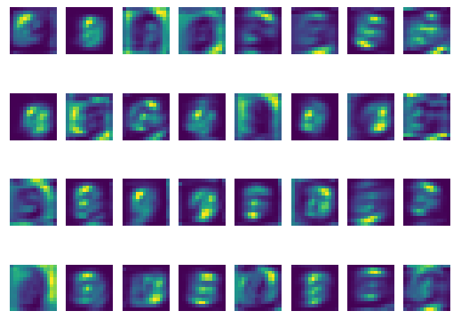

# White Noise Analysis

## Table of Contents

-   [References](#references "References for this work")
-   [About White Noise Analysis](#about-white-noise-analysis)
-   [CNN Architecture](#cnn-architecture)
    -   [Smaller CNN](#smaller-cnn)
    -   [Larger CNN](#larger-cnn)
-   [Training the Model](#training-the-model)
-   [Classification Images](#classification-images)
    -   [Smaller CNN](#classification-smaller-cnn)
        -   [MNIST](#classification-smaller-cnn-mnist)
        -   [Fashion-MNIST](#classification-smaller-cnn-fashion)
    -   [Larger CNN](#classification-larger-cnn)
        -   [MNIST](#classification-larger-cnn-mnist)
        -   [Fashion-MNIST](#classification-larger-cnn-fashion)
-   [Spike Triggered Analysis](#spike-triggered-analysis)
    -   [Smaller CNN](#spike-smaller-cnn)
        -   [MNIST](#spike-smaller-cnn-mnist)
        -   [Fashion-MNIST](#spike-smaller-cnn-fashion)
    -   [Larger CNN](#spike-larger-cnn)
        -   [MNIST](#spike-larger-cnn-mnist)
        -   [Fashion-MNIST](#spike-larger-cnn-fashion)

---

## References

1. [White Noise Analysis of Neural Networks](https://arxiv.org/pdf/1912.12106.pdf)

2. [White Noise Analysis of Neural Networks Repository](https://github.com/aliborji/WhiteNoiseAnalysis)

---

## About White Noise Analysis

Neural network systems can be introduced to bias through:

-   The environment and training data
-   Constraints of the neural network system

It is important that we explore these biases because they:

-   Provide a deeper understanding of the system
-   Exposes vulnerabilities within the system
    -   Strengthens the system against adversarial attacks

---

## CNN Architecture

Two CNN architectures were used in this repository. One of the architectures can be compared with a simplified version of a VGG convolutional network. The other architecture is more complex and is akin to a ResNet structure, using blocks to compose the layers of the model.

### Smaller CNN

The smaller CNN architecture follows the concept of the VGG16 neural network structure, by layering convolutional layers (with ReLU activation) and max pooling, then using fully connected layers.

The size of the network is reduces in this architecture due to the smaller input images it is taking, as well as a desire for a basic model that can train and test things quickly.

The smaller CNN is structured as follows:

-   2 convolutional layers
-   2 max pooling layers
-   1 fully connected layer

After each layer of convolution, as well as the fully connected layer, batch normalization is applied followed by a ReLU activation function.

The model can be visualized in the image below.

### Larger CNN

The larger CNN architecture is inspired by the ResNet model which uses residual blocks to form layers in the model.

This architecture varies from the ResNet models due to a lack of max pooling, having only one of the four layers perform downsampling, and a varying (but configurable) number of blocks per layer.

The larger CNN utilizes:

-   An initial convolutional layer with 7x7 kernel size, and a stride of 2 (downsampling the image by half)
-   Batch normalization and ReLU activation
-   4 layers with a variable number of blocks, each block containing:
    -   2 convolutional layers, both followed by batch normalization
    -   Skip connection via the addition of an identity input, with downsampling added when necessary
    -   A ReLU activation at the end
-   An adaptive average pooling to an output size of 1

## Training the Model

The models are trained using an **Adam** optimizer and **Cross Entropy** loss. Model data is saved after each epoch.

The training process logs information that can be useful for debugging and analyzing the model:

After the training process, the resulting training data is saved (as a compressed `.npz` file) in case it needs to be further analyzed. The training data is also plotted as an overview of the training process.

---

## Classification Images

To analyze bias using classification images, the following actions were performed for each of the models:

-   Classification images were determined by generating a large number of samples of white noise and evaluating the predictions of those samples
-   The average noise map inputted into the images is then fed back into the CNN to determine what they are classified as
-   The average noise map is used as a classifier for the dataset and plot the accuracies in a confusion matrix

Sample stimulus for both the MNIST and Fashion-MNIST are shown in the images below, using a gamma value of `0.5` (where gamma is the percentage of signal vs. white noise).

The classification image data is shown below for each of the models.

### Smaller CNN

#### MNIST

#### Fashion-MNIST

### Larger CNN

#### MNIST

#### Fashion-MNIST

---

## Spike Triggered Analysis

The following data shows the average activations for each channel in the kernel.

Spike triggered analysis of a kernel's receptive field is currently a WIP.

### Smaller CNN

#### MNIST

Conv1 Layer (32x26x26)

Conv2 Layer (64x11x11)

#### Fashion-MNIST

Conv1 Layer (32x26x26)

Conv2 Layer (64x11x11)

### Larger CNN

#### MNIST

Layer 1 (16x14x14)

Layer 2 (32x14x14)

Layer 3 (64x7x7)

Layer 4 (128x7x7)

#### Fashion-MNIST

Layer 1 (16x14x14)

Layer 2 (32x14x14)

Layer 3 (64x7x7)

Layer 4 (128x7x7)

